<div align="center">


</div>

<div align="center">

[](https://git.io/typing-svg)

</div>

---

## 👋 About Me

```python
class MahmoudErfan:
    def __init__(self):
        self.name        = "Mahmoud Erfan Eid Abdelnaser"
        self.university  = "Higher Technological Institute 10th of Ramadan (HTI)"
        self.degree      = "Mechatronics Engineering — GPA: 3.34 / 4.0"
        self.graduation  = "May 2026"
        self.location    = "Cairo, Egypt"
        self.research    = "AI-Driven Robotics & Post-Disaster Urban Resilience"
        self.focus       = ["Autonomous Systems", "Computer Vision", "NLP", "UAV Control"]
        self.currently   = [
            "AI Researcher @ Nile University",
            "AI Instructor @ iSchool — 880+ students mentored",
            "President, Apex Racing Autonomous Team"
        ]

    def fun_fact(self):
        return "Presented research at NetMob 2025 in Paris — top 13 papers, oral presentation 🗼"

me = MahmoudErfan()
print(me.fun_fact())
```

---

## 🚗 Autonomous Systems in Action

<div align="center">

<picture>
  <source media="(prefers-color-scheme: dark)" srcset="./assets/autonomous_banner.svg">
  
</picture>

</div>

---

## 🏆 Highlights

<div align="center">

| 🗼 NetMob 2025 — Paris | 🥇 EVER Egypt 2024 | 🎓 Afretec Scholar | 🌍 NASA Space Apps |
|:---:|:---:|:---:|:---:|
| First Author — Oral Presentation | 1st Place, Autonomous Track | Fully Funded — AUC Smart Systems | AGRI-NAUTS Team Leader |
| Top 13 papers globally | Competing vs. national teams | Embedded AI & IoT | 92% disease detection accuracy |

</div>

---

## 🔬 Research & Publications

### 📄 First Author — NetMob Conference 2025 · Paris, France
> **Post-Disaster Route Reliability Assessment Using Drone-Aided Mobility Data**

- ✅ Accepted with **Strong Accept** (1st review) and **Accept** (2nd review)
- 🎤 Selected among the **top 13 papers** for oral presentation
- ✈️ Awarded a **competitive financial travel grant** to present in Paris
- 🧠 Proposed a data-driven framework using drone-aided mobility, hazard simulations, and network analytics to identify fragile yet critical urban routes for post-disaster resilience

---

## 🚀 Projects

### 🚗 Autonomous Golf Car — Apex Racing Team
Built a full self-driving system from the ground up:
`LiDAR` · `Monocular Vision` · `ROS` · `Pure Pursuit Path-Following` · `AI Pedestrian Detection`
> 🥇 **1st Place — Autonomous Track, EVER Egypt 2024**

### 🌾 AI Agriculture App — NASA Space Apps (AGRI-NAUTS)
Mobile app integrating multiple AI models for agricultural intelligence:
`ARIMA` · `RNN` · `LSTM` · Drought forecasting · Disease detection (**92% accuracy**) · Soil prediction · Chatbot + Marketplace

### 🚁 Autonomous Drones — Nile University Research
UAV control and simulation research environment:
`AirSim` · `PX4 Autopilot` · `QGroundControl` · `Unreal Engine` · `Ubuntu`

---

## 💼 Experience Timeline

```
Apex Racing Team       President, Autonomous Team  Feb 2024 – Present
iSchool Edtech         AI Coding Instructor        Aug 2024 – Sep 2025   (880+ students)
Nile University        AI Research Intern          Jul 2025 – Sep 2025
Sprints                AI Intern                   May 2025 – Jun 2025
NASA Space Apps        AGRI-NAUTS Team Leader      Jul 2024 – Oct 2024
NTI                    AI Intern                   Jun 2024 – Aug 2024
```

---

## 🛠️ Tech Stack

<div align="center">

### AI & Machine Learning


### Robotics & Autonomous Systems


### Tools


</div>

---

## 🎓 Education & Programs

| Institution | Program | Period |
|---|---|---|
| 🏛️ HTI | B.Sc. Mechatronics Engineering — GPA 3.34/4.0 | 2021 – 2026 |
| 🔬 Nile University | Summer Research Internship — AI & Robotics | Jul–Sep 2025 |
| 🎓 AUC | Afretec Scholar — Smart Systems, AI & IoT | Aug–Sep 2024 |
| 🌐 American Center Cairo | Leadership Excellence Program | May–Jul 2025 |
| 🌍 Soliya / Aspen Institute | Global Circles Exchange Program | Feb 2025 |

---

## 🏅 Awards

- 🥇 **1st Place** — Autonomous Track, EVER Egypt Competition
- 🥉 **3rd Place** — Cost & Manufacturing Track, EVER Egypt Competition
- 🏀 **1st Place** — 3x3 Basketball Championship *(Best Player)*
- 🏀 **1st Place** — High Schools Basketball Championship
- 🏀 **2nd Place** — Egypt Republic Basketball Championship

---

## 📊 GitHub Stats

<div align="center">


</div>

<div align="center">


</div>

---

## 📫 Let's Connect

<div align="center">

[](https://www.linkedin.com/in/mahmoud-erfan-eid/)
[](mailto:Mahmouderfan46@gmail.com)
[](https://github.com/Moerfan23)

</div>

---

<div align="center">


*"Building intelligent systems that navigate the world — one algorithm at a time."*


</div>
